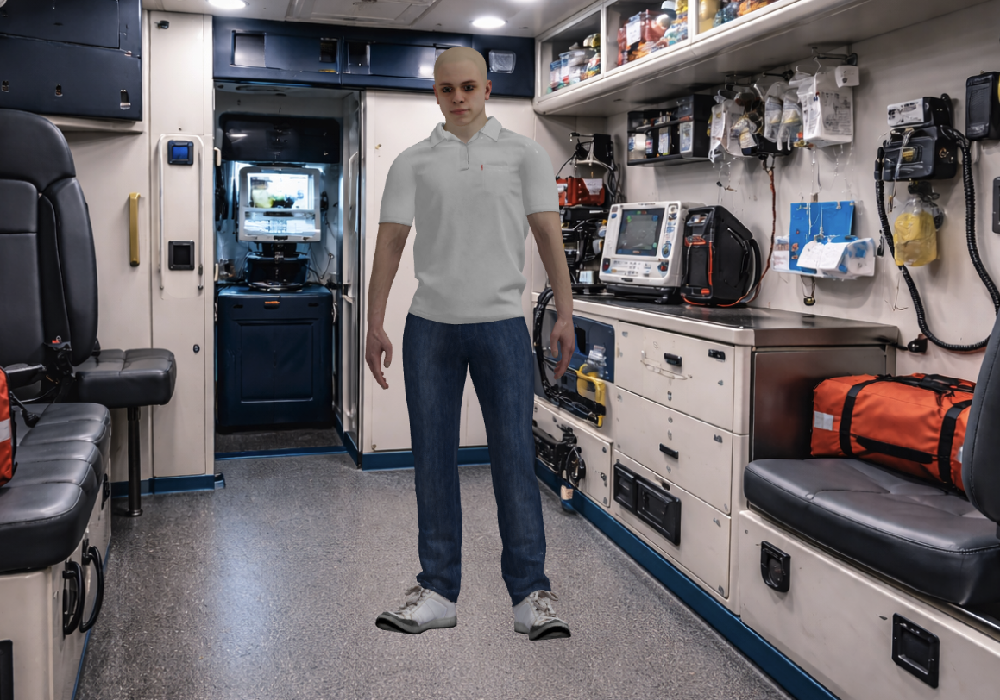
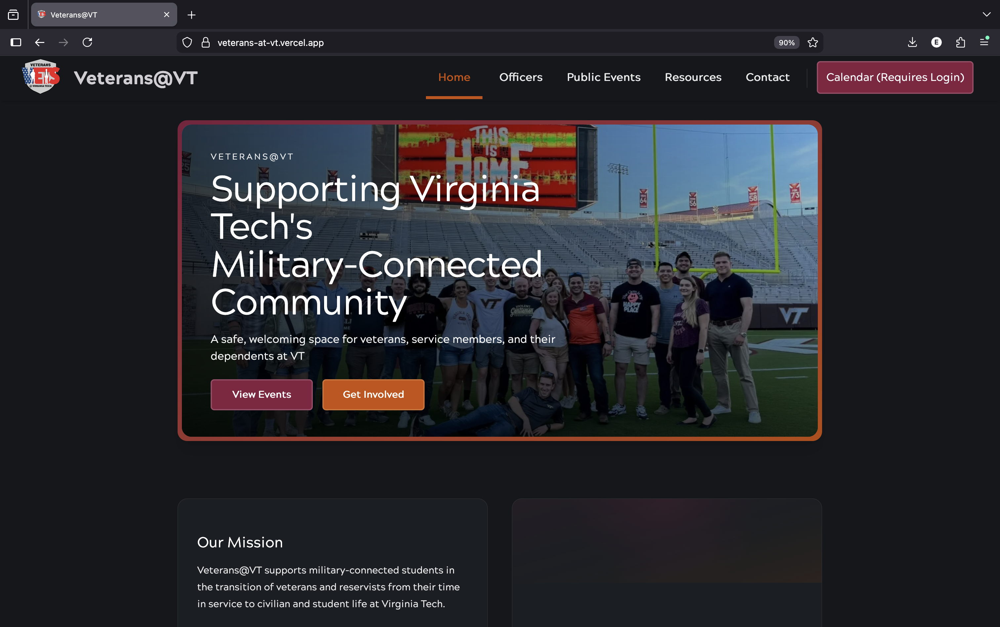
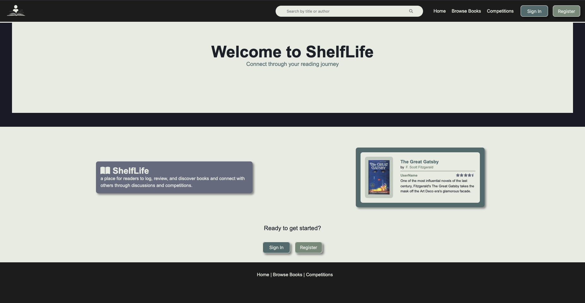

<!-- INTRO -->

  

## 🌸 About Me

I'm a graduate student in the M.Eng. Computer Science & Applications program at Virginia Tech with a background in clinical neuroscience, healthcare systems, and software engineering.

My path into computer science began after working in a hospital system, where I started building tools and automations to support clinical teams. That experience sparked my interest in designing systems that improve workflows and make complex work easier for the people doing it.

Today, my interests include software development, human-computer interaction (HCI), and cybersecurity. I enjoy building projects that create meaningful impact, particularly in healthcare, education, and community-focused environments.

<!-- CONTACT INFO -->

- emilyhhurst1@gmail.com
  

- [linkedin.com/in/emily-h-hurst](https://www.linkedin.com/in/emily-h-hurst/)

<!-- SKILLS -->

## My Skills

| Category                 | Technologies                                                                                                                                                                                                |
| ------------------------ | ----------------------------------------------------------------------------------------------------------------------------------------------------------------------------------------------------------- |
| **Languages**            |                                                                                                                     |
| **Frontend**             |                                                                                |
| **Backend**              |                                                                                                                       |
| **Databases**            |               |
| **Cloud & DevOps**       |                                                                                                                |
| **Auth & Security**      | OAuth2, JWT, RBAC, bcrypt  |
| **Data & Visualization** | Pandas, Plotly, Dash                                                                                                     |

 |
| **Systems & Networking** | SDN, Ryu, Mininet   |

| **Tooling** | 

|

<!-- PROFILE STATS + CHARTS -->

# GitHub Stats

<!-- Streak -->

  

 

<!-- Stats + Languages -->

  
  

 

<!-- Profile Views -->

  

---

# Activity Graph

<!-- Activity Graph -->

  

---

<!-- PROJECTS -->

## 🌸 Featured Projects

<table>
  <tr>
    <td width="50%" align="center">
      <h3>Alexandria Virtual Patient Simulation Platform</h3>
    
        
        AI-driven EMS training simulation using speech recognition and real-time avatars. 
      

  

<a href="https://github.com/ehhurst/alexandria-virtual-patient">Repo →</a>

</td>

<td width="50%" align="center">

<h3>Veterans@VT Website</h3>

  

Website for Veterans@VT student organization at Virginia Tech. Features outlook calendar integration, admin-editable content, and a shared-password member portal.

  

  

<a href="https://github.com/ehhurst/vets-at-vt">Repo →</a>

</td>

  </tr>

  <tr>
    <td width="50%" align="center">
    
  <h3>ShelfLife</h3>

  

A full-stack social media-like web application for avid readers designed to promote social reading through features like book reviews, personalized libraries, reading goals, and reading competitions. 

  

  

<a href="https://github.com/ehhurst/social-books">Repo →</a>

</td>

<td width="50%" align="center">

<h3>MCAT App</h3>

  

A full-stack platform that helps low-income premedical students prepare for the MCAT using personalized study plans, free practice questions, and analytics-driven recommendations. 

  

  

<a href="https://github.com/ehhurst/mcat-app">Repo →</a>

</td>
  </tr>
</table>

---
